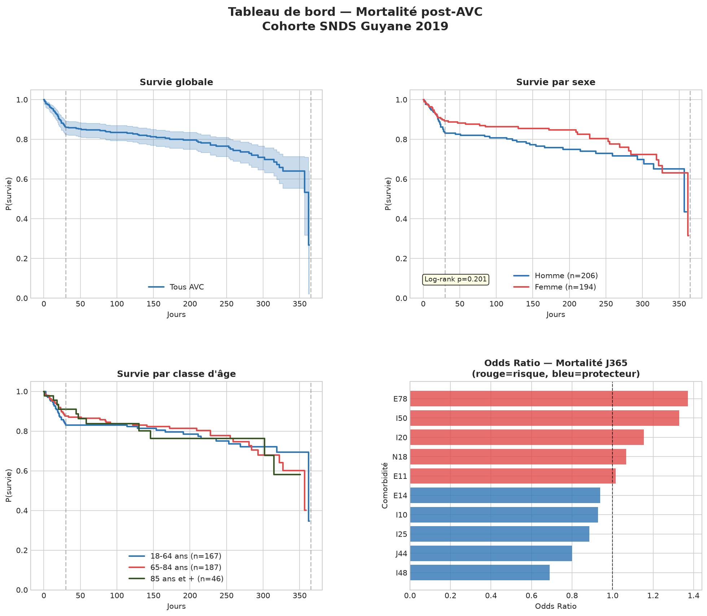
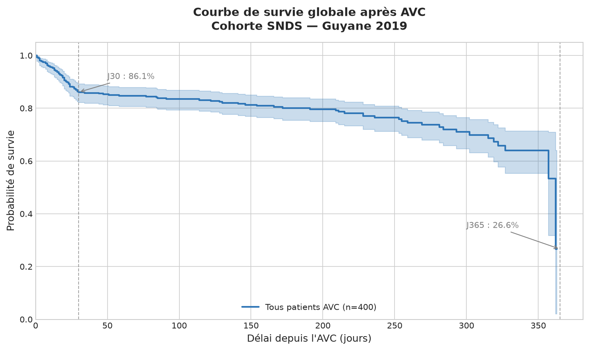
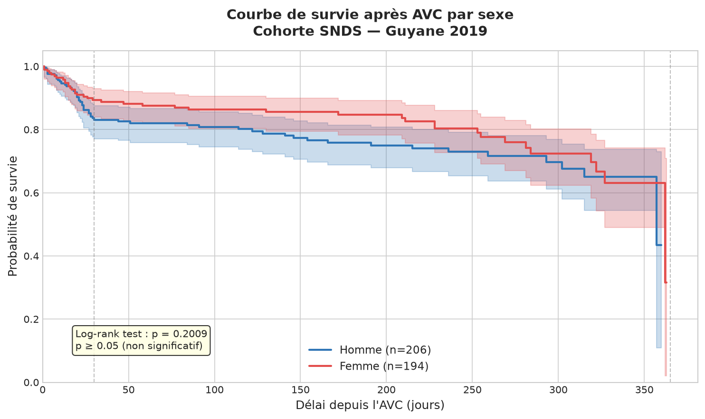
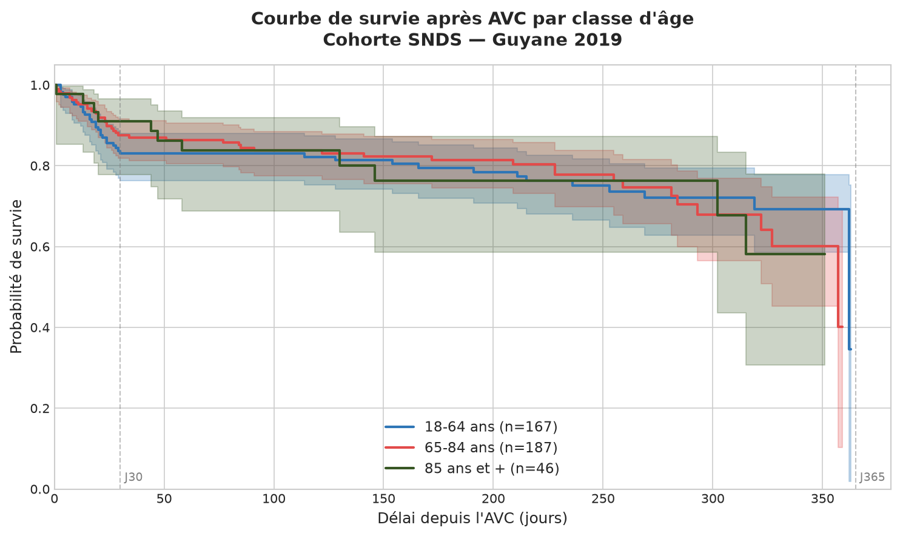
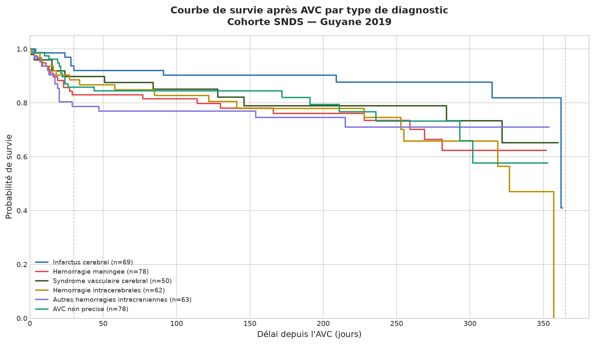

# SNDS — Analyse de la mortalité post-AVC

Analyse épidémiologique de la mortalité à J30 et J365
après Accident Vasculaire Cérébral (AVC) à partir des
données SNDS (PMSI-MCO, DCIR, CépiDc).

## ⚠️ Avertissement

Ce projet est une reproduction en Python d'une étude réalisée en SAS
à l'Observatoire Régional de Santé de Guyane (ORS).
Les données utilisées sont **entièrement simulées** (400 patients).
Aucune donnée patient réelle n'a été utilisée à aucune étape.
Les résultats présentés (survie, mortalité, dépenses) sont obtenus
sur ce jeu simulé. Ils ne reflètent pas les données réelles de la Guyane.

## Contexte

- **Étude** : mortalité post-AVC à J30 et J365
- **Source** : ORS Guyane (reproduction Python depuis SAS)
- **Données** : SNDS (PMSI-MCO, DCIR, CépiDc)
- **Statut** : données simulées, aucune donnée réelle

## Tableau de bord — Résultats

## Courbes de survie Kaplan-Meier

### Survie globale après AVC

### Survie par sexe

### Survie par classe d'âge

### Survie par type d'AVC

## Tables SNDS utilisées

| Table | Source | Contenu |
|-------|--------|---------|
| T_MCO_B | PMSI | Résumés de sortie MCO |
| T_MCO_C | PMSI | Table de chaînage NIR |
| T_MCO_D | PMSI | Diagnostics associés |
| T_MCO_GV | PMSI | Valorisation GHM |
| IR_BEN_R | SNDS | Référentiel des bénéficiaires |
| ER_PRS_F | DCIR | Prestations de soins de ville |
| ER_PHA_F | DCIR | Pharmacie |

## Cohorte

- **400 patients AVC** identifiés (I60-I64 + G46)
- **Période** : 2019
- **Territoire** : Guyane (BDI_DEP = 9C)
- **Population** : Adultes ≥ 18 ans
- **Exclusions** : APHP · APHM · HCL (doublons inter-régionaux)
- **Filtres qualité** : 7 contrôles NIR (NIR_RET, NAI_RET, SEX_RET...)

## Indicateurs de survie

- **J30** : qualité de la phase aiguë (prise en charge initiale)
- **J365** : efficacité du parcours de soins (rééducation, suivi)

## Résultats (données simulées)

| Indicateur | Résultat |
|---|---|
| Patients AVC identifiés | 400 |
| Survie à J30 | **86.5%** |
| Survie à J365 | **76.8%** |
| Mortalité à J30 | **13.5%** |
| Mortalité à J365 | **23.2%** |
| Dépense totale post-AVC | **628 212 €** |
| Dépense moyenne / patient | **1 571 €** |
| Médicament le plus coûteux | Xarelto — 17 541 € |

## Dépenses post-AVC par catégorie

| Catégorie | Total | Part |
|---|---|---|
| Hospitalisation (MCO + SSR) | 447 796 € | 71.3% |
| Médecins | 116 236 € | 18.5% |
| Pharmacie | 58 726 € | 9.3% |
| Kinésithérapie | 5 454 € | 0.9% |

## Pipeline
## Méthodes statistiques

### Régression logistique
- Facteurs associés à la mortalité à J365
- Gestion déséquilibre : `class_weight='balanced'`
- Métriques : OR · IC95% · AUC-ROC · F1-score

### Kaplan-Meier
- Courbes de survie globale et par sous-groupes
- Test log-rank hommes vs femmes : p = 0.201
- Médiane de survie : 362 jours

### Test de robustesse
- Cross-validation stratifiée 5 folds
- Bootstrap 100 itérations
- AUC CV : 0.443 ± 0.032 (normal sur données simulées)

## Avertissement méthodologique

La définition des comorbidités repose sur les diagnostics
associés (ASS_DGN) du PMSI, avec une recherche sur les
3 premiers caractères.
Les données étant simulées, les résultats ne sont pas
interprétables en tant que données réelles.

## Technologies

## Statut

Projet terminé — code reproductible, résultats documentés.

## Auteur

**Octavien YAMESSE**
- GitHub : [octa425](https://github.com/octa425)
- Repo pipeline PMSI : [pmsi-dagster-pipeline](https://github.com/octa425/pmsi-dagster-pipeline)

